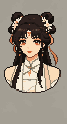

# AIPixelImageConversionTool · AI 像素图转换工具

> 该工具将 AI 扩散模型生成的伪像素图一键转换为规范像素图。
> 
> One‑click conversion of fake pixel art from AI diffusion models into clean standard pixel art. 

[English](#english-summary) · [中文](#中文说明)

---

## 中文说明
### 简介
> 将AI生成的伪像素图转化为像素图。
> 
> 支持导入文件夹批量处理
> 
> 提供简易的编辑功能，用于手动修复没能完美处理的像素图

### 效果
AI生成的像素图1

转化后

AI生成的像素图2

转化后

### 处理流程
`输入图像 → 降噪 →（可选放大）→ 网格检测 → 块提取 → 调色板精炼 → 标准像素图`

### 文档
- [核心算法与流水线](docs/CORE_PIPELINE_ALGORITHMS.md)

### 许可证
[MIT](LICENSE) © 2026 qianmozhiyu

---

## English Summary
### Introduction
> Convert fake pixel art generated by AI into proper pixel art.
> 
> Support batch processing by importing folders.
> 
>Provide simple editing functions to manually fix imperfect conversion results.

### Workflow
`Input Image → Denoise → (Optional Upscale) → Grid Detection → Block Extraction → Palette Refinement → Standard Pixel Art`

### Documents
- [Core Pipeline & Algorithms](docs/CORE_PIPELINE_ALGORITHMS.md)

### License
[MIT](LICENSE) © 2026 qianmozhiyu
